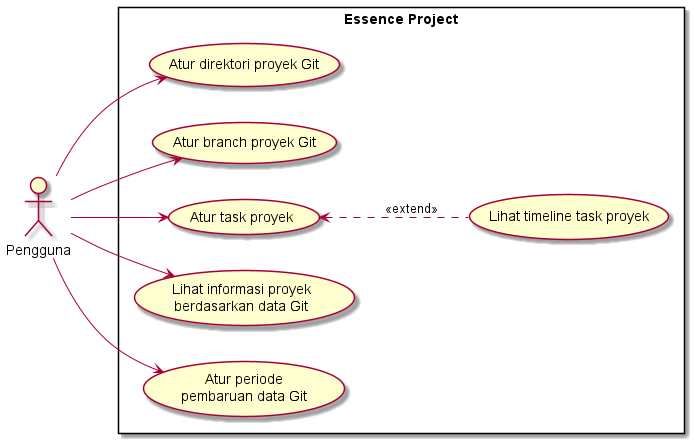
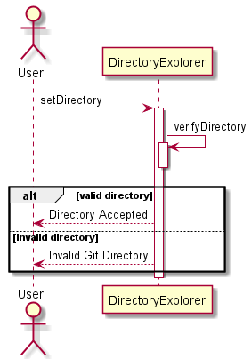
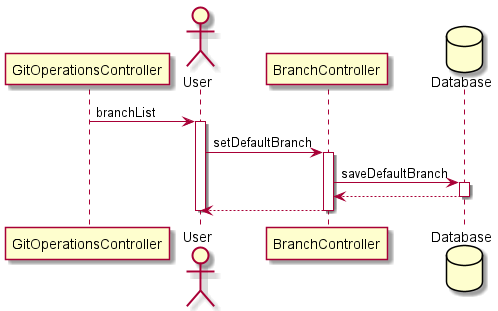
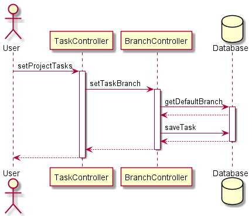
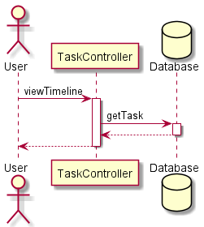
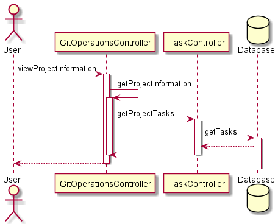
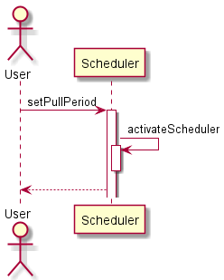

# GitMonitor Docs

## Software Requirements Docs
### Use case diagram

### Sequence diagram
#### Use case "Atur direktori proyek Git"

#### Use case "Atur branch proyek Git"

#### Use case "Atur task proyek"

#### Use case "Lihat timeline task proyek"

#### Use case "Lihat informasi proyek berdasarkan data Git"

#### Use case "Atur periode pembaruan data Git"

## Technical Docs
### High-level architecture
TBD

### ER Diagram
TBD
