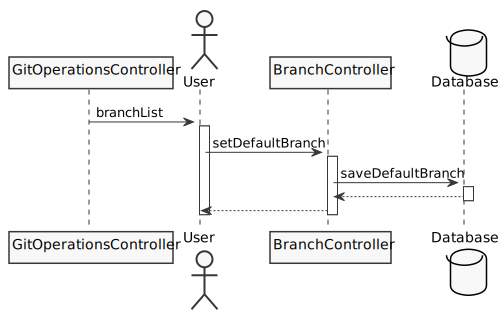
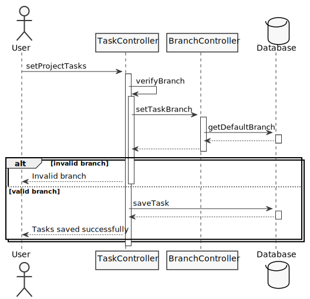
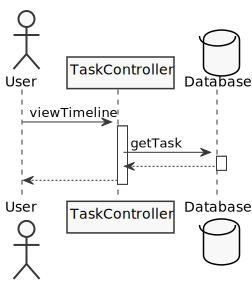
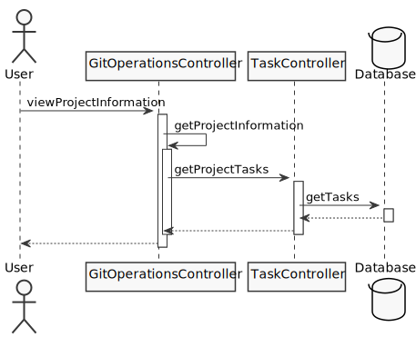
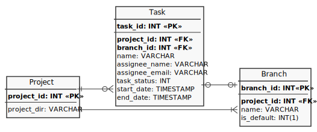

# GitMonitor Design Docs

## Software Requirements Docs
### Use case diagram

There are 6 main use-cases with its corresponding sequence diagram
- [Atur direktori proyek Git](#use-case-atur-direktori-proyek-git)
- [Atur branch proyek Git](#use-case-atur-branch-proyek-git)
- [Atur task proyek](#use-case-atur-task-proyek)
- [Lihat timeline task proyek](#use-case-lihat-timeline-task-proyek)
- [Lihat informasi proyek berdasarkan data Git](#use-case-lihat-informasi-proyek-berdasarkan-data-git)
- [Atur periode pembaruan data Git](#use-case-lihat-informasi-proyek-berdasarkan-data-git)

### Sequence diagram
#### Use case "Atur direktori proyek Git"

#### Use case "Atur branch proyek Git"

#### Use case "Atur task proyek"

#### Use case "Lihat timeline task proyek"

#### Use case "Lihat informasi proyek berdasarkan data Git"

#### Use case "Atur periode pembaruan data Git"

## Technical Docs
### High-level architecture

Each layer in application is tightly coupled. Users can only interact with the application using application UI provided. The application logics will serve all the logics needed to run the application, performing Git operations to a Git repositoriy and read/write operations to the embedded database.

### ER Diagram

